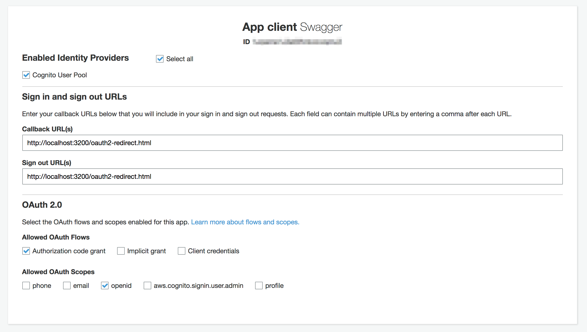
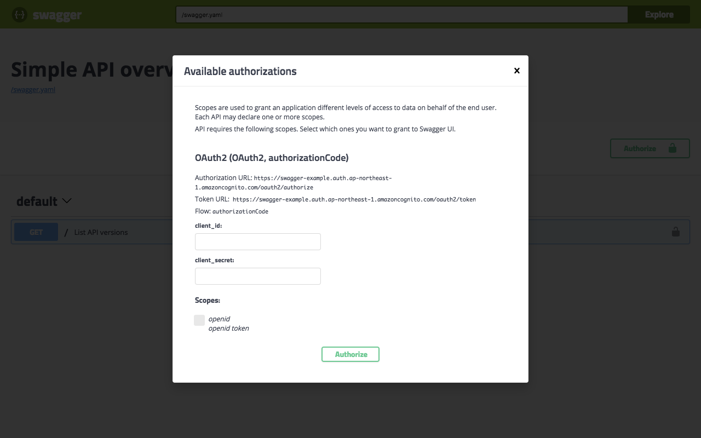

# Swagger 3.0 OAuth 2.0 Authentication & Authorization using Amazon Cognito

## How To Use

### Create Cogntio User Pools Client



### Modify swagger.yaml

```
components:
  securitySchemes:
    OAuth2:
      type: oauth2
      description: For more information, see https://docs.aws.amazon.com/cognito/latest/developerguide/cognito-userpools-server-contract-reference.html
      flows:
        authorizationCode:
          authorizationUrl: https://<your domain>.auth.ap-northeast-1.amazoncognito.com/oauth2/authorize
          tokenUrl: https://<your domain>.auth.ap-northeast-1.amazoncognito.com/oauth2/token
          scopes:
            openid: openid token
```

### docker-compose up

```bash
$ docker-compose up -d
```

### Access

http://localhost:3200/


